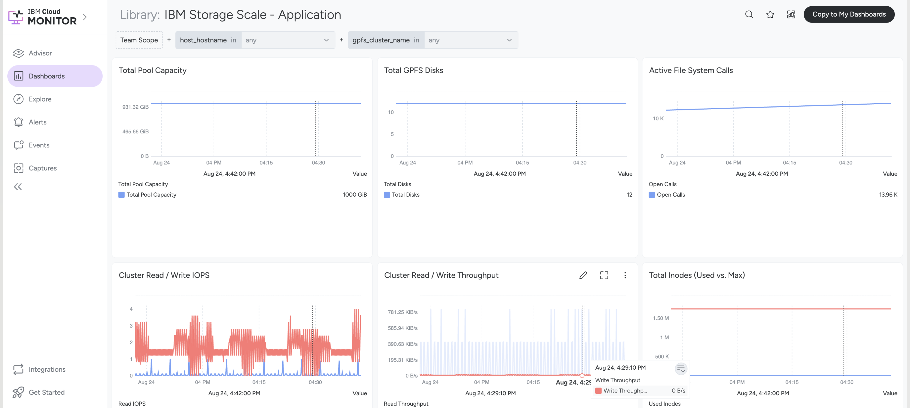
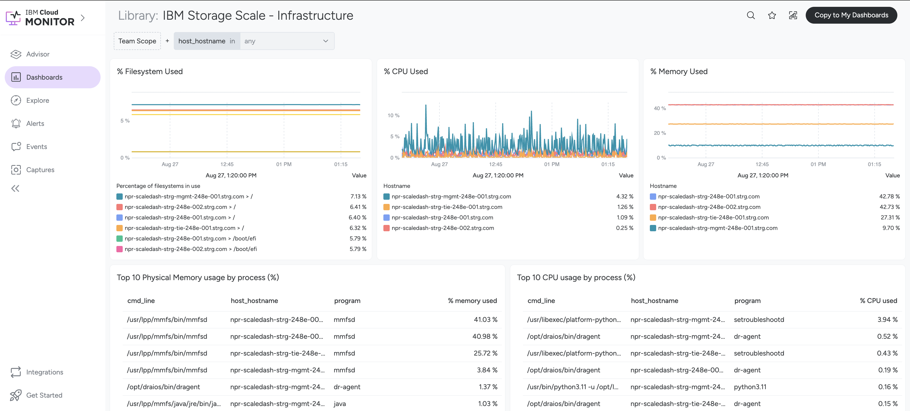

---

copyright:
  years: 2026
lastupdated: "2026-09-17"

keywords:

subcollection: storage-scale-da

---

{:shortdesc: .shortdesc}
{:codeblock: .codeblock}
{:screen: .screen}
{:external: target="_blank" .external}
{:pre: .pre}
{:tip: .tip}
{:note: .note}
{:important: .important}
{:step: data-tutorial-type='step'}
{:table: .aria-labeledby="caption"}

# IBM Cloud Monitoring
{: #cloud-monitoring-overview}

IBM Cloud® Monitoring is a cloud-native and container-intelligence management system that is included as part of your IBM Cloud architecture. The cloud monitoring is used to gain operational visibility into the performance and health of your applications, services, and platforms. It offers administrators, DevOps teams, and developers full-stack telemetry with advanced features to monitor and troubleshoot, define alerts, and design custom dashboards.

| Value | Description | Type | Default value | Validation |
| ----- | ----------- | --------------- | ------------ | ------------ |
| `observability_monitoring_enable` | Set this value as "true" to enable the IBM Cloud Monitoring integration. If enabled, the IBM Storage Scale bridge for Grafana is deployed on management nodes, and the unified Sysdig agent is deployed across all Scale nodes to capture infrastructure and filesystem metrics. | bool | false |
| `observability_monitoring_plan` | This is a type of service plan for IBM Cloud Monitoring instance. You can choose one of the following: lite or graduated-tier. For more information, refer to the [IBM Cloud Monitoring Service Plans](/docs/monitoring?topic=monitoring-service_plans). | string | "graduated-tier" | * Condition: Validates if the value matches lite or graduated-tier.  \n * **Error Message**: "Please enter a valid plan for {{site.data.keyword.monitoringlong_notm}}, for all details visit https://cloud.ibm.com/docs/monitoring?topic=monitoring-service_plans." |
| `observability_enable_metrics_routing` | Enable the metrics routing to manage metrics at the account level by configuring targets and routes that define how the data points are routed. | bool | false |
{: caption="{{site.data.keyword.monitoringlong_notm}} variables" caption-side="bottom"}

You can use {{site.data.keyword.metrics_router_full_notm}}, a platform service to manage metrics at the account-level by configuring targets and routes that define where data points are routed.

To check whether Cloud Monitoring is configured correctly on your VSI, SSH into the instance and run the following commands:

Check the status of the IBM Storage Scale bridge (runs on Management nodes only):

```pre
systemctl status grafana-bridge.service
```
{: codeblock}

Check the status of the unified metrics and security agent (runs on all Scale nodes):

```pre
systemctl status dragent
```
{: codeblock}

Go to the `cloud_monitoring_url` in the terraform output.
For example: https://cloud.ibm.com/observe/embedded-view/monitoring/e68481cb-21ff-45bb-90db-cee02cebed3d

Following are the steps to manually access the dashboard:

1. Go to **Observability** > **Monitoring** > **Instances**.
2. Search the name of the metrics instance.
3. On the right-side, click **Dashboards**.
4. In the dashboard library, you can search for two specific dashboards to view your visual confirmations:

    * Search for **IBM Storage Scale - Application** to view metrics such as total pool capacity, total GPFS disks, active file system calls, cluster read/write IOPS, cluster read/write throughput etc.

    {: caption="IBM Storage Scale - Application" caption-side="bottom"}

    * Search for **IBM Storage Scale - Infrastructure** to monitor node-level performance, including percentage of filesystem used, % CPU used, % memory used, the top 10 processes consuming physical memory and CPU etc.

    {: caption="IBM Storage Scale - Infrastructure" caption-side="bottom"}

## Key features
{: #key-features}

Following are the key features of {{site.data.keyword.monitoringlong_notm}}:

* Consolidate time-series data within the region where your primary operations are based.
* Route time-series data to one or multiple target locations as needed.
* Improve your data residency compliance by ensuring data remains at rest within the designated regions.

Custom dashboards are not automatically created in the EU-ES (Madrid) region.
{: note}

## References
{: #ref}

For more information on {{site.data.keyword.monitoringlong_notm}}, refer to the following documentation links:

* [About IBM Cloud Metrics Routing in IBM Cloud](/docs/metrics-router?topic=metrics-router-about&interface=ui)
* [Getting started with IBM Cloud Monitoring](/docs/monitoring?topic=monitoring-getting-started)
