---

copyright:
  years: 2026
lastupdated: "2026-05-26"

keywords:

subcollection: storage-scale-da

---

{:shortdesc: .shortdesc}
{:codeblock: .codeblock}
{:screen: .screen}
{:external: target="_blank" .external}
{:pre: .pre}
{:tip: .tip}
{:note: .note}
{:important: .important}
{:step: data-tutorial-type='step'}
{:table: .aria-labeledby="caption"}

# Enabling Active File Management to Cloud Object Storage
{: #config-afm-integration-cos}

Active File Management (AFM) to Cloud Object Storage (COS) is a feature that integrates {{site.data.keyword.scale_full_notm}} with {{site.data.keyword.cos_full_notm}}. Active File Management provides a hybrid cloud storage solution by allowing Storage Scale to interact with COS as a storage target. AFM enables data sharing across clusters even if the networks are unreliable or have high latency.

You can use COS to run the workloads such as mobile applications, backup and restore, enterprise applications, big data analytics, and file server. These workloads can be cached on AFM to COS file sets for faster computation and synchronize back to the Cloud Object Storage server.

{: caption="AFM storage scale framework" caption-side="bottom"}

An AFM to COS file set is supported on all existing AFM file set modes that includes Read-Only (RO), Single Writer (SW), Local Updates (LU), and Independent Writer (IW).

{{site.data.keyword.scale_full_notm}} AFM gateway nodes can be a set of BMS or VSIs.
{: note}

## Key features and benefits of COS-AFM
{: #keybenefits-cos-afm}

* **Cloud Object Storage Integration:** COS-AFM allows {{site.data.keyword.scale_full_notm}} to use IBM Cloud Object Storage as a storage target. This integration facilitates the movement of data between on-premises storage and cloud storage, enabling hybrid cloud solutions.

* **Data Caching and Tiering:** COS-AFM supports caching frequently accessed data locally within the IBM Storage Scale system while storing less frequently accessed data in IBM COS. This tiering approach optimizes data access performance and storage costs.

* **Disaster Recovery and Data Protection:** COS-AFM enables disaster recovery and data protection by replicating data to IBM COS. This ensures that a copy of the data is stored in a geographically separated location, providing resilience against data loss or system failures.

* **Secure Data Management:** COS-AFM supports secure data transmission and storage by using IBM COS built-in security features, such as encryption and access controls, to protect sensitive data.

## Before you begin
{: #beforeyoubegin-afm}

Before you begin, review the following information:

1. Make sure to complete the steps for [Getting started with IBM Storage Scale](/docs/storage-scale-da?topic=storage-scale-da-before-begin-deploy).

2. Learn more about active file management by referring [Introduction to AFM to cloud object storage](https://www.ibm.com/docs/en/storage-scale/6.0.0?topic=overview-introduction-afm-cloud-object-storage).

## Configuring AFM deployment
{: #configure-afm-deployment}

To enable the AFM feature on a Scale cluster, the following variables need to be defined in your workspace.

|AFM Variable|	Description|	Example value|
|-------------|------------|--------------|
| `afm_instances` | Specify the list of virtual server instances to be provisioned as AFM nodes in the cluster. Each object in the list includes the instance profile (machine type), the count (number of instances), the image (OS image to use). This configuration allows you to access remote data and high-performance computing needs. This input can be used to provision virtual server instances (VSI). If persistent, high-throughput storage is required, consider using bare metal instances instead. Ensure you provide valid instance profiles. Maximum of 16 afm nodes is supported. For more information, see [Instance Profiles](/docs/vpc?topic=vpc-profiles&interface=ui). | [{profile = "bx2d-32x128" count  = 0 image  = "hpcc-scale5232-rhel810-v1"}] |
| `afm_cos_config` | Provide details for the Cloud Object Storage (COS) instance, including information about the COS bucket, service credentials (HMAC key), AFM file set, mode (such as Read-only (RO), Single writer (SW), Local updates (LU), and Independent writer (IW)), storage class (standard, vault, cold, or smart), and bucket type (single_site_location, region_location, cross_region_location). Note : The `afm_cos_config` can contain up to 5 entries. For more information, see [Endpoints and storage locations](/docs/cloud-object-storage/basics?topic=cloud-object-storage-endpoints). | [{afm_fileset  = "afm_fileset" mode  = "iw" cos_instance  = "" bucket_name  = "" bucket_region  = "us-south" cos_service_cred_key = "" bucket_storage_class = "smart" bucket_type  = "region_location"}] |
{: caption="AFM variables" caption-side="bottom"}

Following components are required for a successful scale deployment with AFM feature:

* **Storage Cluster:** This includes designated storage and a set of AFM gateway node.

* **File sets:** Created on the storage cluster with the appropriate file set mode specified in the configuration variables.

* **Cloud Object Storage (COS):** COS buckets that are defined with specified bucket types and storage classes with HMAC keys for secure access.

## Verifying AFM on the storage cluster
{: #verify-afm-storage-cluster}

Verify Active File Management on the Storage Cluster by using the following steps:

1. Login to one of the storage nodes by using SSH with a jump host by running the command: `ssh -J root@BASTION_SERVER vpcuser@STORAGE_NODE`

2. To get details about a specific file set and its mode (including AFM specifics), run the `mmlsfileset fs1 fileset1 --afm -L` command.

    * fs1: The name of the file system.
    * fileset1: The name of the file set.
    * --afm: Option to include AFM-specific details.
    * -L: Option to list all details about the file set.

3. To check the synchronization status from an AFM file set to the home cluster, run the `mmafmctl  fs1 getstate -j fileset1` command.
    * fs1: The name of the file system.
    * getstate: The operation to retrieve the state.
    * -j fileset1: Specifies the file set for which to check the synchronization state.

4. To check the HMAC for a bucket, run the `mmafmcoskeys storage-scale-bucket get` command.
    * storage-scale-bucket: The name of the Cloud Object Storage bucket.
    * get: Operation to retrieve the HMAC key associated with the specified bucket.

## LDAP user access to COS file sets
{: #ldap-user-access-cos}

To adjust the ownership, group, and permissions of the file set to meet the specific needs of the users. While our automation process creates the file set and establishes the initial relationship, it is the responsibility of the system administrator or user to make sure that these settings are correctly configured afterward. This approach ensures that the LDAP users can access the data with the necessary permissions, maintaining a secure and manageable environment. Properly managing ownership and permissions provides a controlled way for users to interact with the fileset while preserving the integrity and security of the system.
