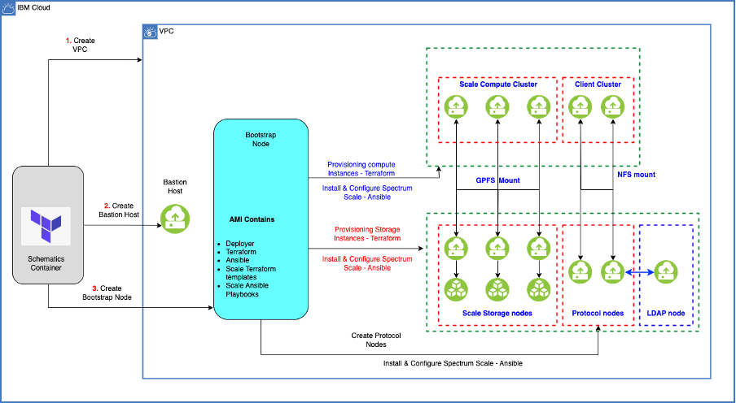

---

copyright:
  years: 2025
lastupdated: "2025-08-21"

keywords:

subcollection: storage-scale-da

---

{:shortdesc: .shortdesc}
{:codeblock: .codeblock}
{:screen: .screen}
{:external: target="_blank" .external}
{:pre: .pre}
{:tip: .tip}
{:note: .note}
{:important: .important}
{:step: data-tutorial-type='step'}
{:table: .aria-labeledby="caption"}

# Enabling cluster export services
{: #config-ces-integration-ldap-authentication}

Cluster Export Services (CES) is a key component of the {{site.data.keyword.scale_full_notm}} architecture, which is designed to enable access to data stored in the Scale cluster and Object Storage (Storage Scale) system. CES plays a critical role in providing efficient and versatile data access to meet the diverse needs of modern enterprises. This flexibility allows organizations to support a wide range of applications and its use cases.

Enabling colocation designates the subset of Storage server as protocol nodes. If disabled, protocol nodes are created on dedicated virtual servers or bare metal, depending on the specified protocol server profile.

The colocation feature avoids the need to provision extra virtual servers and improves the performance. It is also supported on Bare Metal servers.

{: caption="CES node on Storage Scale" caption-side="bottom"}

## Before you begin
{: #beforeyoubegin-config-ces}

Before you begin, review the following information:

1. To begin the deployment for the Scale cluster, refer to [Before you begin deploying](/docs/storage-scale-da?topic=storage-scale-da-before-begin-deploy) topic.

2. For more information on cluster export service see, [how CES works](/docs/storage-scale-da?topic=storage-scale-da-config-ces-integration-ldap-authentication&interface=ui#verify-ces) topic.

## Configuring CES deployment
{: #procedureconfig-ces-deploy}

To enable the CES feature on a Scale cluster, the following variables need to be defined in your workspace.

|CES Variable|	Description|	Example value|
|-------------|------------|--------------|
|`protocol_subnets_cidr`|Provide the CIDR block required for the creation of the protocal private subnet. One CIDR block is required. If using a hybrid environment, modify the CIDR block to avoid conflicts with any on-premises CIDR blocks. Ensure the selected CIDR block size can accommodate the maximum number of scale storage nodes expected in your cluster. For more information on CIDR block size selection, refer to the documentation, see [Choosing IP ranges for your VPC](https://cloud.ibm.com/docs/vpc?topic=vpc-choosing-ip-ranges-for-your-vpc).	| "10.241.40.0/24" |
|`protocol_instances`|Specify the list of virtual server instances to be provisioned as protocol nodes in the cluster. Each object in the list defines the instance profile (machine type), the count (number of instances), the image (OS image to use), and an optional filesystem mount path. This configuration allows you to customize the compute tier of the cluster based on your performance and workload requirements. For more details, refer [Instance Profiles](https://cloud.ibm.com/docs/vpc?topic=vpc-profiles&interface=ui). |[{ profile = "bx2d-16x64" count  = 2 image  = "hpcc-scale5232-rhel810-new" }]|
|`filesets_config`| Specify a list of filesets with client mount paths and optional storage quotas (0 means no quota) to be created within the IBM Storage Scale filesystem. |[{ client_mount_path = "/mnt/scale/tools" quota  = 0 }, {client_mount_path = "/mnt/scale/data" quota  = 0 }] |
|`client_instances`	|Defines the list of virtual server instances to be provisioned as client nodes in the cluster. Each object in the list specifies the instance profile (machine type), the count (number of instances), and the image (OS image to use). This allows you to customize the hardware configuration and image for the client nodes based on your workload requirements. The profile must match a valid IBM Cloud VPC Gen2 instance profile format. For more details, refer [Instance Profiles](https://cloud.ibm.com/docs/vpc?topic=vpc-profiles&interface=ui). | [{ profile = "cx2-2x4" count  = 0 image  = "ibm-redhat-8-10-minimal-amd64-6" }] |
|`colocate_protocol_instances`|Enable it to use storage instances as protocol instances. | true |
{: caption='CES Variables'}

The successful scale deployment with the CES feature enabled consists of different clusters:

*   Storage cluster with defined storage and CES protocol nodes.
*   Client cluster with defined client nodes that mounts file shares that are exported by protocol nodes with NFS protocol.
*   (Optional) Compute cluster with defined compute nodes.

## Verifying CES on the file system
{: #verify-ces}

1.	Log in to any of the clusters (storage or compute nodes) by running the following SSH command:

    ```pre
    ssh -J root@BASTION_SERVER vpcuser@STORAGE_NODE
    ```

2.	To view the cluster shared root configuration on the storage cluster, run the following command:

    ```pre
    mmlsconfig cesSharedRoot
    ```

3.	To list the protocol nodes in the cluster, run the following command:

    ```pre
    mmces node list
    ```

4.	To view the protocol cluster information, use the mmlscluster command:

    ```pre
    mmlscluster --ces
    ```

5.	Use the service list command that provides comprehensive list of the services that are running in the CES cluster, use --verbose and -a flag for detailed information:

    ```pre
    mmces service list --verbose -a
    ```

6.	Use the mmuserauth command to view the details on the type of authentication used for CES:

    ```pre
    mmuserauth service check
    ```

7.	Use the mmnfs export command to add, change, list, load, or remove NFS export declarations for IP addresses on nodes that are configured as CES types. Use list to view the current NFS exports:

    ```pre
    mmnfs export list
    ```

8.	Use the mmlsquota command to display quota information for a user, group, or file set. The -j flag is used for displaying the quota for file set in a file system.

    ```pre
    mmlsquota -j data FILESYSTEM
    ```

The CES feature is only available with the custom image that is provided by the solution.
{: note}
