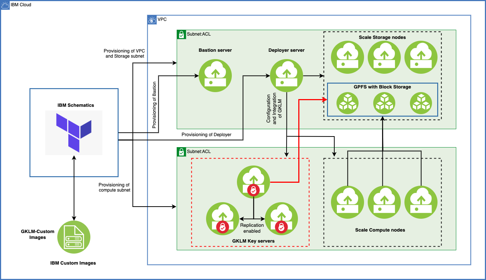

---

copyright:
  years: 2025
lastupdated: "2025-08-25"

keywords:

subcollection: storage-scale-da

---

{:shortdesc: .shortdesc}
{:codeblock: .codeblock}
{:screen: .screen}
{:external: target="_blank" .external}
{:pre: .pre}
{:tip: .tip}
{:note: .note}
{:important: .important}
{:beta: .beta}
{:row-headers: .row-headers}
{:table: .aria-labeledby="caption"}

# Enabling encryption
{: #enable-encryptions}

The {{site.data.keyword.scale_short}} cluster file system can be encrypted by using the IBM Security® Guardium® Key Lifecycle Manager (GKLM) or the IBM KeyProtect. You can enable encryption features during deployment. The encryption provides highly available key servers for cryptographic operations on the GPFS file system.
{: shortdesc}

## Enabling encryption by using GKLM
{: #enable-encryption-gklm}

The following diagram is an example of a {{site.data.keyword.scale_short}} deployment with encryption enabled. The deployment includes key servers that use the GKLM application.

{: caption="{{site.data.keyword.scale_short}} deployment with encryption" caption-side="bottom"}

By setting the `scale_encryption_type` deployment value to `gklm`, the key servers are automatically deployed and configured for encryption during the deployment.

### Before you begin
{: #before-you-begin-gklm}

Before you begin, review the following tasks:

1. To begin with the Scale cluster deployment, see [Before you begin deploying](/docs/storage-scale-da?topic=storage-scale-da-before-begin-deploy) topic.
2. For more information on file system encryption, see [GKLM](https://www.ibm.com/docs/en/storage-scale/5.2.3?topic=environment-simplified-setup-using-sklm-self-signed-certificate){: external}.

A minimum of two key servers are added to the cluster to avoid a single point of failure.
{: note}

### Configuring encryption deployment values
{: #configure-encryption-values-gklm}

To enable encryption on a Scale cluster, the following variables need to be defined in your workspace.

| Encryption variable | Description | Example value |
| ------------------- | ----------- | ------------- |
|`scale_encryption_enabled` | Encryption ensures that data stored in the filesystem is protected from unauthorized access and secures sensitive information at rest. To enable the encryption for the filesystem, select true or false. | true or false |
|`scale_encryption_type` | To enable filesystem encryption, specify either `key_protect` or `gklm` value. If neither is specified, the default value will be 'null' and encryption is disabled. | `gklm` |
|`gklm_instances` | Specify the list of virtual server instances to be provisioned as Guardium Key Lifecycle Manager (GKLM) nodes in the cluster. Each object in the list includes the instance profile (machine type), the count (number of instances), and the image (OS image to use). This configuration allows you to manage and securely store encryption keys used across the cluster components. The profile must match a valid IBM Cloud VPC Gen2 instance profile format. A minimum of 2 and maximum of 5 GKLM nodes are supported. For more information, see [Instance Profiles](/docs/vpc?topic=vpc-profiles&interface=ui). | [{profile = "bx2-2x8" count  = 2 image  = "hpcc-scale-gklm4202-v2-5-3"}] |
| `scale_encryption_admin_password` | Specifies the administrator password for GKLM-based encryption. This is required when encryption is enabled for IBM Spectrum Scale (GPFS) and the encryption type is set to `gklm`. The password is used to authenticate administrative access to the Guardium Key Lifecycle Manager (GKLM) for managing encryption keys. Ensure the password meets your organizations security standards. | `xxxxxxx` |
{: caption="Encryption variables and example values" caption-side="bottom"}

After a successful cluster creation, the following resources are automatically configured to encrypt the file system:

* The key servers are deployed along with the Scale cluster.
* The admin password is updated for the GKLM application.
* An SSL certificate is created on the key server.
* Replication occurs between the primary and clone key servers.
* The key servers are added to each cluster (storage and compute).
* Tenants and clients are created on each cluster.
* The master key is created for encrypting the file system.
* An encryption policy is created and applied to the file system.

The storage and compute clusters have access to the encrypted file system, and any files that are created on the file system are encrypted.

### Verifying encryption on the file system
{: #verify-encryption-gklm}

1. Log in to any of the clusters (storage or compute nodes) by running the following SSH command:

    ```ssh
    ssh -J ubuntu@<replace this with your bastion_node IP address> vpcuser@<replace this with your storage_node IP address>
    ```
    {: codeblock}

2. List the key server that was added to the cluster by running the following command:

    ```text
    mmkeyserv server show
    ```
    {: codeblock}

3. List the key components, for example tenant or client, by running the following commands:

    ```text
    mmkeyserv tenant show
    ```
    {: codeblock}

    ```text
    mmkeyserv client show
    ```
    {: codeblock}

4. Validate the policy that was applied to the cluster by running the following command:

    ```text
    mmlspolicy FILESYSTEM_NAME -L
    ```
    {: codeblock}

5. Check the encrypted file by running the following command:

    ```text
    mmlsattr -n gpfs.Encryption FILE_NAME
    ```
    {: codeblock}


To learn more about encryption for {{site.data.keyword.scale_short}} or different encryption use cases, see [Encryption](https://www.ibm.com/docs/en/storage-scale/5.2.3?topic=administering-encryption){: external}.

### Accessing the GKLM dashboard
{: #access-gklm}

1. Open a new command line terminal.
2. Run the following commands from the local machine:

    ```pre
    ssh -L 9443:localhost:9443 -J ubuntu@<bastion_host_IP> vpcuser@<first_GKLM_server>
    ```

3. Open the browser on the local system, and run https://localhost:9443/.
4. Enter the username **SKLMAdmin** and the password that you set for `scale_encryption_admin_password` when you create your workspace to access the GKLM GUI.

## Enabling encryption by using IBM KeyProtect
{: #enable-encryption-keyprotect}

The Scale cluster file system can be encrypted using IBM® Key Protect. The IBM Key Protect helps you to provision and store encrypted keys for applications across IBM Cloud services, so that you can see and manage data encryption and the entire key lifecycle from one central location.

By setting the `scale_encryption_type` deployment value to `key_protect`, the key servers are automatically deployed and configured for encryption during the deployment.

### Before you begin
{: #before-you-begin-keyprotect}

Before you begin, review the following tasks:

1. To begin the deployment for the Scale cluster, see [Before you begin deploying](/docs/storage-scale-da?topic=storage-scale-da-before-begin-deploy) topic.
2. For more information on file system encryption, see using [IBM Key Protect](/docs/key-protect?topic=key-protect-getting-started-tutorial).

### Configuring encryption deployment values
{: #configure-encryption-values-keyprotect}

To enable encryption on a Scale cluster, the following variables need to be defined in your workspace.

| Encryption variable | Description | Example value |
| ------------------- | ----------- | ------------- |
|`scale_encryption_enabled` | Encryption ensures that data stored in the filesystem is protected from unauthorized access and secures sensitive information at rest. To enable the encryption for the filesystem, select true or false. | true or false |
|`scale_encryption_type` | To enable filesystem encryption, specify either `key_protect` or `gklm` value. If neither is specified, the default value will be 'null' and encryption is disabled. | `key_protect` |
| `scale_encryption_admin_password` | Specifies the administrator password for GKLM-based encryption. This is required when encryption is enabled for IBM Spectrum Scale (GPFS) and the encryption type is set to `gklm`. The password is used to authenticate administrative access to the Guardium Key Lifecycle Manager (GKLM) for managing encryption keys. Ensure the password meets your organization's security standards. | `xxxxxxx` |
|`key_protect_instance_id`| Provide the ID of an existing IBM Key Protect instance to be used for filesystem encryption in IBM Storage Scale. If this value is provided, the automation will use the existing Key Protect instance and create a new encryption key within it. If not provided, a new Key Protect instance will be created automatically during deployment.| Null |
{: caption="Encryption variables and example values" caption-side="bottom"}

### Verifying encryption on the file system
{: #verify-encryption-keyprotect}

1. Log in to any of the clusters (storage or compute nodes) by running the following SSH command and switch to the `root` user:

    ```ssh
    ssh -J ubuntu@<replace this with your bastion_node IP address> vpcuser@<replace this with your storage_node IP address>
    sudo -i
    ```
    {: codeblock}

2. Validate the policy that was applied to the cluster by running the following command:

    ```text
    mmlspolicy FILESYSTEM_NAME -L
    ```
    {: codeblock}

3. Check the encrypted file by running the following command:

    ```text
    mmlsattr -n gpfs.Encryption FILE_NAME
    ```
    {: codeblock}

### Key Protect Instance
{: #keyprotect-instance}

IBM Storage Scale now supports both new and existing Key Protect instances for filesystem encryption.

* If the `key_protect_instance_id` is not set, a new Key Protect instance will be created automatically through our automation.

* If the `key_protect_instance_id` is provided, the existing Key Protect instance will be used for file system encryption and automation will create the key.

The existing Key Protect instance must be in the same region.
{: note}
