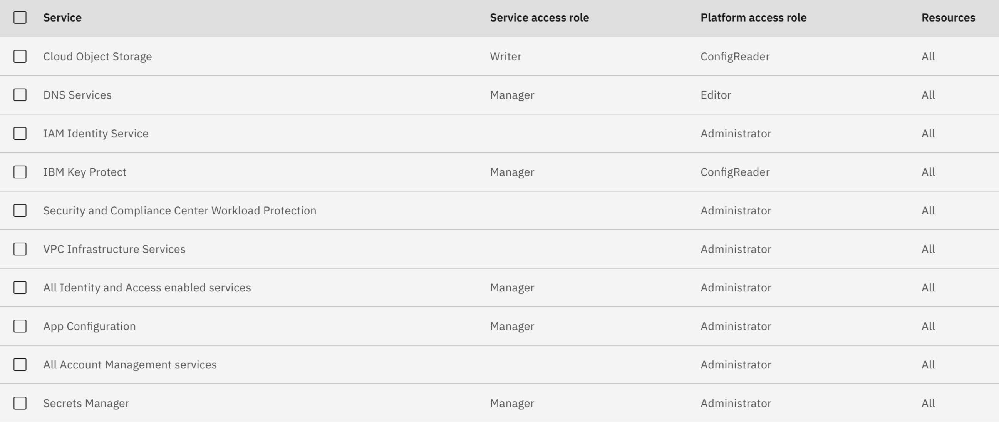

---

copyright:
  years: 2026
lastupdated: "2026-09-23"

keywords:

subcollection: storage-scale-da

content-type: faq

---


{{site.data.keyword.attribute-definition-list}}


# FAQs for IBM Storage Scale
{: #storage-scale-faq}

This document provides a list of frequently asked questions and answers about a specific topic for IBM Storage Scale.
{: shortdesc}

## Release FAQs
{: #current-release}

Here goes all the FAQs that are related to the upcoming/current release.

## General
{: #generic-faqs}

### **What locations are available for deploying the VPC resources that make up the Scale cluster?**
{: #locations-vpc-resources}

The available regions and zones for deploying VPC resources and a mapping them to city locations and data centers can be found in [Locations for resource deployment](/docs/overview?topic=overview-locations){: external}. While any of the available regions can be used, resources are provisioned only in a single availability zone within the selected region.

### **Does the solution support integration with enterprise SIEM platforms such as QRadar?**
{: #qradar}

The solution does not integrate with QRadar or other SIEM platforms. Enterprise customers typically have their own security controls, authentication mechanisms, and on-premise SIEM solutions. Enabling built-in or third-party monitoring by default could conflict with customer-defined security policies and introduce unnecessary costs or redundancy. Therefore, SIEM integration and security monitoring configurations remain optional and customer-controlled.

### **What version of scale supports MROT configuration?**
{: #support-mrot-versions}

Anything above {{site.data.keyword.scale_full_notm}} 5.1.5 supports the Multi-Rail over TCP (MROT) feature.

### **How do you SSH among nodes?**
{: #ssh-among-nodes}

The {{site.data.keyword.scale_full_notm}} solution consists of two separate clusters (storage and compute). The SSH key parameter that is provided through {{site.data.keyword.bpshort}} (`storage_cluster_key_pair` and `compute_cluster_key_pair`) can be used to log in to the respective cluster nodes. You can log in to any node only through the bastion host by using the following command:

```shell
ssh -J ubuntu@<IP_address_bastion_host> vpcuser@<IP-address-of-nodes>
```
{: pre}

Although all the nodes of each cluster have passwordless SSH set up among them, due to security constraints, you cannot directly log in to a node from one cluster to another cluster.
{: note}

### **Why does the UI select multiple SSH keys?**
{: #ssh-keys}

If you want to use multiple SSH keys to access the bastion host, compute cluster, and storage cluster, ensure that the SSH keys are present in the same resource group and region where the cluster is provisioned. You can select the required SSH key for the supported region/zone from the drop-down list. `ssh_keys` is the value required for this variable.

In the UI, the drop-down lists all the available ssh keys from all the regions. If you have a similar name across all the region and you click the drop down, then all the keys are selected but the right SSH key will be picked only in the back-end based upon the input provided for the zones.

{: caption="SSH key" caption-side="bottom"}

For example, in the back-end if the zones provided is [\"us-east-1\"] then only [\"us-east-1\"] zone will be picked.

## Catalog
{: #catalog-faqs}

### **What permissions are required to create a cluster that uses the offering?**
{: #permissions-cluster-offering}

The instructions to set the appropriate permissions for IBM Cloud services platform roles and service roles can be seen in the below screenshots:

{: caption="Granting user permissions - Platform and Service roles" caption-side="bottom"}{: external download="scale-arch-diagram-da.svg"}

### **Why are there two different resource group parameters that can be specified in the IBM Cloud catalog tile?**
{: #resource-group-parameters}

The first resource group parameter entry in the **Configure your workspace** section in the {{site.data.keyword.cloud_notm}} catalog applies to the resource group where the {{site.data.keyword.bpshort}} workspace is provisioned on your {{site.data.keyword.cloud_notm}} account. The value for this parameter can be different than the one used for the second entry in the **Parameters with default values** section in the catalog. The second entry applies to the resource group where VPC resources are provisioned.

### **Can you use own resource group to configure the resources?**
{: #resource-group-configure-resources}

Yes, you can provide the resource group of your choice for the deployment of your cluster's VPC resources. Due to the use of trusted profiles in this offering, you must ensure that all the `key_pair` values that are specified in the deployment values are created in the same resource group.

### **What are trusted profiles and what permissions are required to set up the offering?**
{: #trusted-profiles-required-permissions}

With {{site.data.keyword.scale_short}}, trusted profiles are used to set up granular authorization for applications that are running in compute resources. Therefore, you are not required to create or use service IDs or API keys for the creation of compute resources.

The required set of permissions to create the compute resources are already added as part of the automation code. For more information, see [Creating trusted profiles](/docs/account?topic=account-create-trusted-profile).

## Scale questionnaire
{: #os-faqs}

### **Which operating system versions are supported for the images used for the compute and storage nodes in Storage Scale?**
{: #os-compute-storage-nodes}

In {{site.data.keyword.scale_full_notm}}, either custom or stock images based on RHEL 9 version can be used for compute and storage nodes.

### **How many compute and storage nodes can you deploy in the Scale cluster through this offering?**
{: #how-many-compute-storage-nodes}

Before you deploy a cluster, it is important to make sure that the VPC resource quota is appropriate for the size of the cluster that you would like to create (see [Quotas and service limits](/docs/vpc?topic=vpc-quotas)).

See the following minimum and maximum number of nodes that are supported in a cluster:
* Compute nodes: For all storage clusters, a minimum of 3 and a maximum of 64 virtual server instance compute nodes are supported.
* VSI and evaluation cluster storage nodes: For a VSI and evaluation storage clusters, a minimum of 2 and a maximum of 64 virtual server instance storage nodes are supported.
* Bare-metal cluster storage nodes: For a bare-metal storage cluster, a minimum of 2 and a maximum of 32 bare metal server storage nodes are supported.

For more information, see [Deployment values](/docs/storage-scale-da?topic=storage-scale-da-deployment-values).

### **Can you connect directly through SSH to the deployer, compute, or storage nodes from a system external to IBM Cloud?**
{: #connecting-nodes-external}

No, any SSH connection to the deployer, compute, or storage nodes is only possible through the bastion node for security reasons. You would use the following command to connect to your deployer, compute, or storage nodes (the IP address is specific to your particular node): `ssh -J ubuntu@<bastion_IP_address> vpcuser@<IP_address>`

### **Can you establish an SSH connection between compute and storage nodes?**
{: #establish-connection-between-nodes}

The compute and storage clusters are created to not have the same passwordless SSH keys. This make sure that there are separate administration domains for the compute and storage clusters; therefore, SSH between nodes from different clusters is not possible.

### **Does the Storage Scale offering support multiple `key_pairs` to establish SSH to all of the nodes?**
{: #multiple-key-pairs}

Yes, the current version of the {{site.data.keyword.scale_short}} offering supports multiple key_pair that provide access to all the nodes that are part of the cluster.

### **Why do you need to create a separate StanzaFile for every nodes, even though there is an existing StanzaFile under /var/mmfs/tmp?**
{: #sdp-stanza}

When you have `n` storage_nodes, you cannot create an NSD for all nodes simultaneously, as this will cause conflicts. The NSD is already registered for use by GPFS, so duplicate registration leads to errors. Solution is to create a new stanza file for each node during NSD creation.

```text
[root@hpc-scale-sdp-thu-8-strg-0ea6-001 tmp]# /usr/lpp/mmfs/bin/mmcrnsd -F /var/mmfs/tmp/StanzaFile.test
mmcrnsd: Processing disk vdd
mmcrnsd: Disk name nsd_hpc-scale_sdp_thu_8_strg_0ea6_001_vdd is already registered for use by GPFS.
mmcrnsd: Command failed. Examine previous error messages to determine cause.
[root@hpc-scale-sdp-thu-8-strg-0ea6-001 tmp]#
```
{: codeblock}

### **What storage types are available through this offering?**
{: #storage-types-scale-offering}

The {{site.data.keyword.scale_short}} solution offers three different storage types: VSI, bare-metal, and evaluation. For more information, see [Storage types](/docs/storage-scale-da?topic=storage-scale-da-storage-types).

Parallel vNIC is not supported on the bare-metal storage type and it is only supported by a custom image.
{: note}

### **Can you decrease the capacity size of boot or block volume?**
{: #sdp-capacity}

No, you cannot decrease the capacity size of the boot or block volume once it is added or updated to the file system.

```pre
Error: ---
id: terraform-d8fcbc36
summary: 'UpdateInstance validation failed: Error while updating boot volume size
severity: error
resource: ibm_is_instance
operation: update
component:
name: github.com/IBM-Cloud/terraform-provider-ibm
version: 1.85.0
```

### **If I manually increase the boot or block volume size of one node without updating the other nodes, then update my Terraform configuration to reflect the new size. Will running terraform apply successfully re-apply the changes?**
{: #sdp-terraform-apply}

No, running terraform re-apply after increasing the boot/block volume size of only one node will result in an error. To avoid this, you need to update the boot/block volume size for all nodes to match the latest maximum capacity. After making these updates, run `terraform apply` again with the updated size to ensure consistency across all nodes.

### **What are requirements for the configuration of storage types?**
{: #storage-types-configuration}

* Colocation requires specifying protocol node count. Count must be less than or equal to the storage nodes.
* Boot drive encryption is supported only for bare-metal storage.
* `tie_breaker_bm_server` is not applicable for VSI (only for bare-metal) storage. If specified for VSI, it will be ignored. For bare-metal, if not provided, the storage instance will be considered as the `tie_breaker_bm_server` profile.

### **Why are you not able to see the data on the shared file system storage after stopping the storage nodes?**
{: #not-able-to-see-data}

The {{site.data.keyword.scale_full_notm}} file system data resides on instance storage. In general, data that is stored on instance storage is ephemeral so stopping the storage node results in data loss. However, instance storage data is not lost when an instance is rebooted. For more information, see [Lifecycle of instance storage](/docs/vpc?topic=vpc-instance-storage#instance-storage-lifecycle).

### **Why does Storage Scale not allow use of the default value of 0.0.0.0/0 for security group creation?**
{: #default-value-security-group-creation}

For security reasons, {{site.data.keyword.scale_short}} does not allow you to provide a default value that will allow network traffic from any external device. Instead, you can provide the address of your user system (for example, by using https://ipv4.icanhazip.com/) or a multiple IP address range.

### **Does the solution provide encryption for network traffic between different subnets?**
{: #encryption-traffic}

No, traffic within the internal network is not encrypted by default. Encrypting the traffic between the internal network may cause additional delay and latency which may impact the performance of the solution. All internal communication remains within private, isolated VPC subnets that are protected by network ACLs and security groups, which are treated as trusted zones. While the internal network traffic is not encrypted, the data and file systems residing on the nodes within these subnets are encrypted either by GLKM or Key protect, based on the customer requirements.

### **Why is 0.0.0.0 allowed in the egress rule of a security group?**
{: #sg-egress-rule}

We cannot restrict outbound traffic because customers often maintain connections to on-prem environments for hybrid deployments. Customers use dozens of different applications for their HPC applications and any port to communicate between on-prem and on cloud processes. Restricting the outbound traffic by default and requiring customers to manually open each port would severely impact the usability of our solution.

### **What versions of IBM Storage Scale are currently available, and which are officially supported?**
{: #ss-versions}

The offering uses Bring Your Own License (BYOL) for {{site.data.keyword.scale_full}} when deploying a cluster on {{site.data.keyword.cloud_notm}}. The IBM Storage Scale solution is installed with the **Data Management Edition**. For more information about this edition, see [Features in IBM Storage Scale editions](https://www.ibm.com/docs/en/storage-scale/6.0.0?topic=overview-storage-scale-product-editions#prodstruct__table_atn_tqp_rhb) table.

### Why is `sdp` support restricted to allowlisted customers?
{: #faq-sdp}
{: faq}

Access to the sdp profile is limited to allowlisted accounts. Customers who are not on the allowlist cannot view or provision `sdp` volumes in the console, from the CLI, with the API, or Terraform. Existing sdp volumes are not impacted. To request access, submit an [allowlisting request](https://forms.monday.com/forms/6f855ea28400d75ef31e540e39c1d31a?r=use1&SDSallowlist=){: external}.

For more information see, [SSD defined performance profile](/docs/vpc?topic=vpc-block-storage-profiles&locale=en&interface=ui#defined-performance-profile).

## Authentication/Certificates
{: #password-faqs}

### **Where are the Terraform files used by the IBM Storage Scale tile located?**
{: #terraform-file-location}

The Terraform-based templates can be found in this [GitHub repository](https://github.com/terraform-ibm-modules/terraform-ibm-hpc/blob/main/main.tf){: external}.

### **Where can you find the custom image name to image ID mappings for each cloud region?**
{: #custom-image-mappings}

The mappings can be found in the `image-map.tf` file in this [GitHub repository](https://github.com/terraform-ibm-modules/terraform-ibm-hpc/blob/main/modules/landing_zone_vsi/image_map.tf){: external}.

### **Can you use own custom image in the Scale cluster by specifying the image name in the deployment value `deployer_instance`?**
{: #bring-own-custom-image}

No, you cannot use your own custom image for the deployer node currently. The deployer node image is configured with all of the required functions to setup the {{site.data.keyword.scale_short}} compute and storage resources.

### **What is an IBM Customer Number and what happens if I do not provide it?**
{: #provide-icn}

An {{site.data.keyword.IBM_notm}} Customer Number (ICN) is the unique number that {{site.data.keyword.IBM_notm}} issues its customers during the post-contract signing process. The ICN is important because it allows {{site.data.keyword.IBM_notm}} to identify your company and support contract. Without an ICN, you can't deploy the {{site.data.keyword.scale_short}} resources through {{site.data.keyword.bplong_notm}}.

If the `storage_type` deployment value is set as either "VSI" or "bare-metal", the ICN can't be set as an empty value. An empty value is accepted only if the `storage_type` is set as "evaluation".
{: important}

### **Does the solution support using PAG for Multi-Factor Authentication (MFA)?**
{: #mfa}

The solution supports only SSH connectivity, and no additional ports are allowed. The solution does not include a built-in Multi-Factor Authentication (MFA) mechanism.

Integration with external MFA solutions, such as a Privileged Access Gateway (PAG) is possible, but this introduces additional cost on IBM Cloud since PAG is an optional premium feature. Due to these cost considerations and varying customer security requirements, MFA is not enforced by default and remains an optional, customer-controlled configuration.

## Limitations
{: #limitations-faqs}

### **Why do you see `xxxhiddenxxx` in the deployment output log instead of a variable name that is provided?**
{: #variable-name-issue}

The solution provides useful information in the Terraform output log about the cluster and how to access cluster nodes (for example, SSH command, region, trusted profile ID, etc.n).

The solution is integrated with the {{site.data.keyword.cloud_notm}} cataided there triggers {{site.data.keyword.bpshort}} to deploy the VPC resources that form the cluster. When the system is passing sensitive information such as username and password, if that value matches with data in the deployment logs, {{site.data.keyword.bpshort}} outputs the value as `xxxhiddenxxx` according to an implemented security policy.

### **Why did the destroy process fail to remove resources?**
{: #failed-destroy}

There are a few potential reasons why the destroy process failed to remove resources:

* The input parameter from the deployment value might have been changed for some reason and {{site.data.keyword.bpshort}} is looking for the existing value. Mismatch of values might cause the destroy action to fail.
* If other resources are manually created after deployment of the VPC and subnets through the offering and those resources are associated with the same VPC, the destroy action will fail.
* There might be issues on the {{site.data.keyword.cloud_notm}} infrastructure side that cause the destroy action to fail.

## Error messages
{: #error-faqs}

### **Why does the automation fail for the Bare Metal server capacities?**
{: #bare-metal}

The Bare Metal server capacities are limited and support for only specific regions. You need to check the server capacities are available in that region. If you provide the zones that the Bare Metal does not support, then the automation fails in the planning phase with the error message:

`error_message = "The solution supports bare metal server creation in only given availability zones i.e. us-south-1, us-south-3, us-south-2, eu-de-1, eu-de-2, eu-de-3, jp-tok-2, eu-gb-1, us-east-1, us-east-2, eu-es-3, eu-es-1, jp-tok-3, jp-tok-2, ca-tor-2 and ca-tor-3. To deploy bare-metal storage provide any one of the supported availability zones."`

Before doing a deployment, check in the UI or CLI if the profile is available in the specific region to provision the Bare Metal. For more information, see [Bare Metal Server Profiles](/docs/vpc?topic=vpc-bare-metal-servers-profile&interface=ui).

### **Why do we see the `No image found with name: xxxxxx` error on the client nodes?**
{: #client-node}

This error occurs when you use incorrect image during deployment. You need to change the custom image to stock image and update to the latest version of the stock image (RHEL 9).

### **Why does the `mmlsconfg` command display 6.0.0.0 in the `minReleaseLevel` parameter?**
{: #version-command}

After running the `mmlsconfg` command, the 'minReleaseLevel' parameter displays 6.0.0.0. This is because version 6.0.0.0 includes 'minReleaseLevel' set to 6.0.0.0. For verification of the actual version, run the `mmdiag --version` command.

```pre
[root@test-tie-strg-002 ~]# mmdiag --version

=== mmdiag: version ===
Current GPFS build: "5.2.1.1 ".
Built on Sep 20 2024 at 12:35:51
Running 2 days 2 hours 30 minutes 12 secs, pid 34239
[root@test-tie-strg-002 ~]#
```
