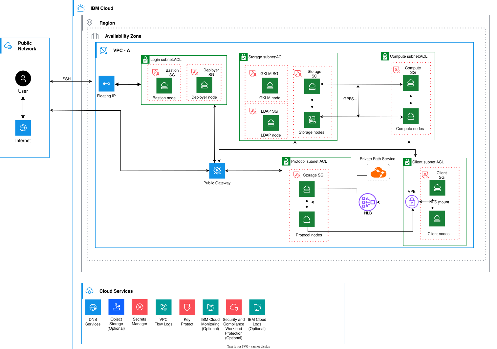
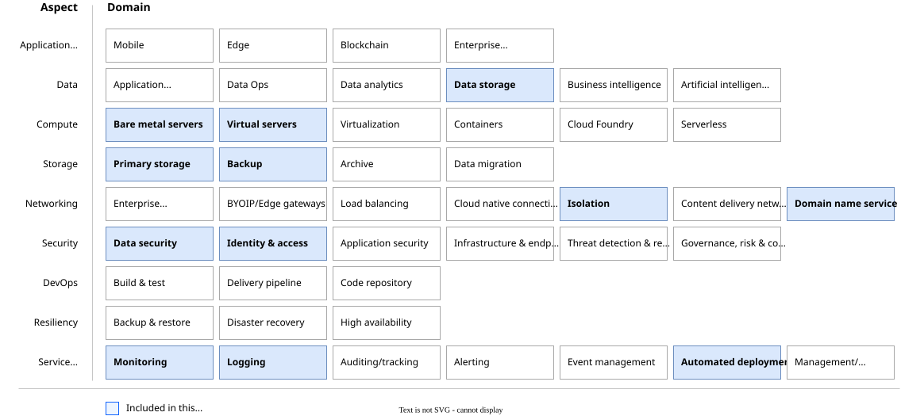

---

copyright:
  years: 2025
lastupdated: "2025-12-10"

keywords: # Not typically populated

subcollection: storage-scale-da

authors:
  - name: Piyush Chaudhary

deployment-url: url

docs: https://cloud.ibm.com/docs/solution-guide

image_source:

use-case: IBM Storage Scale
industry: Electronics, Healthcare, LifeSciences, Automotive, AerospaceAndDefense
compliance:
content-type: reference-architecture

production: false

---

{{site.data.keyword.attribute-definition-list}}

# IBM Storage Scale
{: #storage-scale}
{: toc-content-type="reference-architecture"}
{: toc-industry="Electronics, Healthcare, LifeSciences, Automotive, AerospaceAndDefense"}
{: toc-use-case="StorageScale"}

You can deploy the dedicated Storage Scale cluster for High-Performance Computing (HPC) clusters using IBM Storage Scale as the storage solution. This offering leverages deployable architecture automation to streamline the provisioning and configuration of the cloud resources. In simple steps, you can define the configuration properties and make use of automated deployment to build your own storage-rich clusters in minutes. {{site.data.keyword.scale_full}} supports the configuration of both compute and storage nodes, allowing you to build a complete, end-to-end Storage cluster.

## Architecture diagram
{: #architecture-diagram}

{: caption="Storage Scale Architecture diagram" caption-side="bottom"}{: external download="scale-arch-diagram-da.svg"}

## Design concepts
{: #design-concepts}

The architecture framework design covers design considerations and architecture decisions for the following aspects and domains:

* **Data:** Data storage
* **Compute:** Virtual servers
* **Storage:** Primary storage
* **Networking:** Isolation and domain name service
* **Security:** Data security
* **Service management:** Logging and automated deployment

{: caption="Architecture design scope" caption-side="bottom"}{: external download="RA-ibm-cloud-scale-heatmap-phase.svg"}

## Requirements
{: #requirements}

The following table outlines the requirements that are addressed in this architecture.

| Aspect | Requirements |
| -------------- | -------------- |
| Data            | Provide a location to store {{site.data.keyword.scale_full_notm}} configuration and data. |
| Compute            | Provide properly isolated compute resources with adequate compute capacity for the applications. |
| Storage            | Provide storage that meets the application and database performance requirements. |
| Networking         | * Deploy workloads in an isolated environment and enforce information flow policies. \n * Distribute incoming application requests across available compute resources. \n * Support failover of application within the cluster event of planned or unplanned node outage. \n * Provide private DNS resolution to support the use of hostnames instead of IP addresses. |
| Security           | * Ensure that all operator actions are run securely through bastion host. \n * Provide users with the ability to use keys to ensure that all data meets regulatory compliance requirements for more security and user control. \n * Protect secrets through their entire lifecycle and secure them using access control measures.|
| Service Management | * Monitor system and application health metrics and logs to detect issues that might impact the availability of the application. \n * Monitor audit logs to track changes and detect potential security problems. |
{: caption="Requirements" caption-side="bottom"}

## Components
{: #components}

| Aspects | Requirement | Architecture component | How the component is used |
|-------------|-------------|-----------|--------------------|
| Data and Storage | GPFS or NFS | * Storage Scale nodes \n * Protocol nodes| These components are used to create storage elements for the cluster. |
| Compute | Create Virtual Server Instances (VSI) to support LDAP. | Scale LDAP nodes | Allows you to login through LDAP users. |
|  | Create VSI to support GPFS based compute nodes. | Scale compute nodes | This component is used to create the GPFS compute nodes. |
|  | Create VSI to support NFS based client nodes. | Scale client nodes | This component is used to create the NFS based client nodes. |
|  | Create VSI to support NFS based protocol nodes. | Scale protocol nodes | This component is used to create the NFS based protocol nodes. |
|  | Create VSI to support NFS based client protocol nodes. | Protocol client nodes | This component is used to create the NFS based client protocol nodes. |
|  | Create VSI to support Storage Scale nodes. | Storage Scale nodes | Creates VSI to support the Storage Scale nodes. |
|  | Create VSI to support GKLM. | GKLM nodes | Create VSI to support GKLM nodes. |
| Networking | * Bastion node \n * Deployer node \n * GKLM node \n * LDAP node | Security group rules for each subnet | As an alternative, more CIDR or ports can be manually added after deployment. |
|  | Enable floating IP on bastion node for user access. | Floating IP on the bastion node | Allows user access to the Scale VPC. |
|  | Enable a public gateway for the Scale management subnet. | * Storage Scale subnet \n * Scale compute subnet | Allows outbound communication for the Scale management node for any internet access (for example, repositories, packages, and so on). |
|  | DNS service for the Scale cluster nodes | DNS service | Helps with the IP and name resolution for the Scale compute nodes. |
| Security | Provide users with the ability to use keys to ensure that all data meets regulatory compliance requirements for more security and user control. | [{{site.data.keyword.keymanagementservicefull}}](/docs/key-protect) | Provides the ability to use keys to ensure that all data meets regulatory compliance requirements for more security and user control. |
|  | Protect secrets through their entire lifecycle and secure them using access control measures. | [{{site.data.keyword.cloud}} Secrets Manager](/docs/secrets-manager?topic=secrets-manager-getting-started&interface=ui) | Protects secrets through their entire lifecycle and secure them using access control measures.
| Service Management | (Optional) Monitor system and application health metrics and logs to detect issues that might impact the availability of the application. | * [{{site.data.keyword.monitoringfull_notm}}](/docs/monitoring?topic=monitoring-getting-started) \n * [IBM Security® Guardium® Key Lifecycle Manager (GKLM)](/docs/en/storage-scale/5.2.3?topic=environment-simplified-setup-using-sklm-self-signed-certificate)| Monitors system and application health to detect issues that might impact the availability of the application. |
|  | (Optional) Monitor audit logs to track changes and detect potential security problems. | [{{site.data.keyword.atracker_full}}](/docs/atracker?topic=atracker-getting-started) | Monitors audit logs to track changes and detect potential security problems. |
{: caption="Components" caption-side="bottom"}
