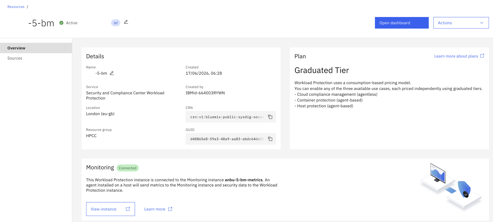
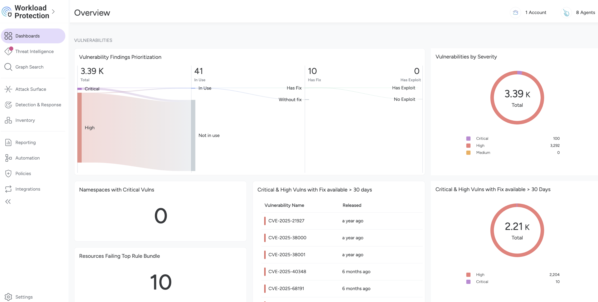
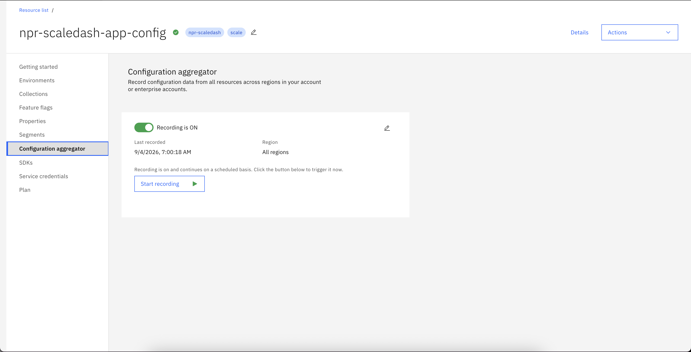
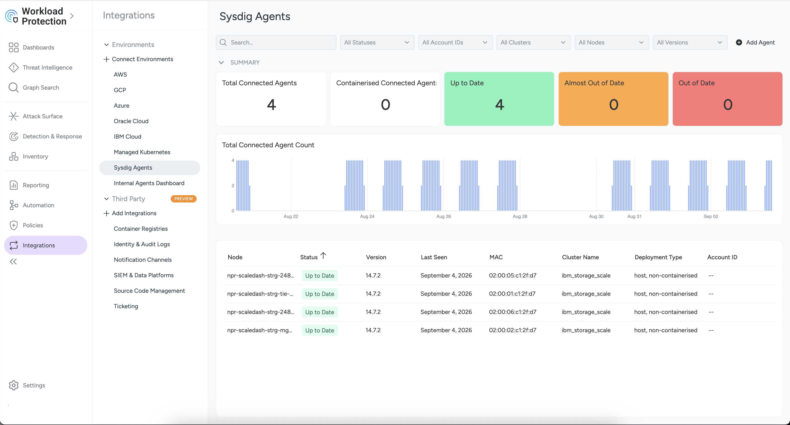
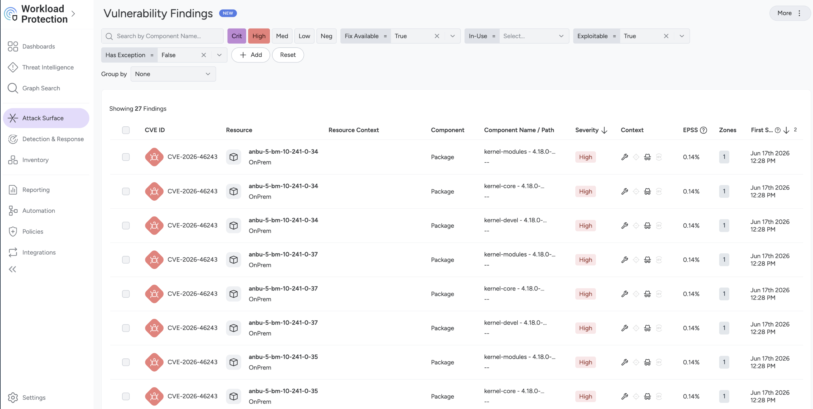
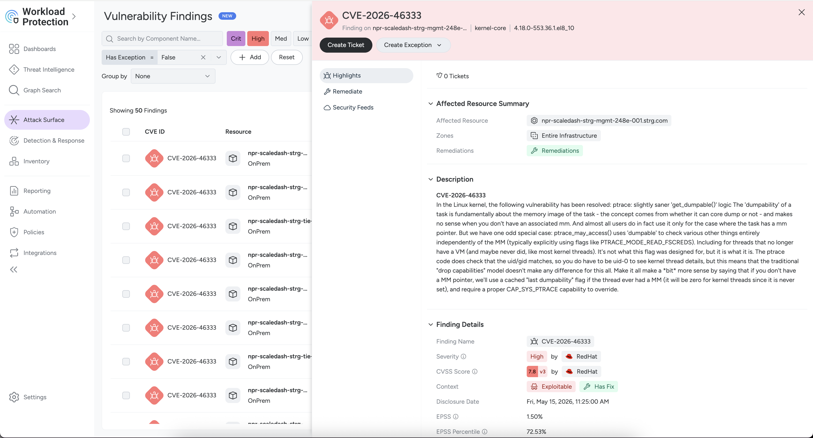
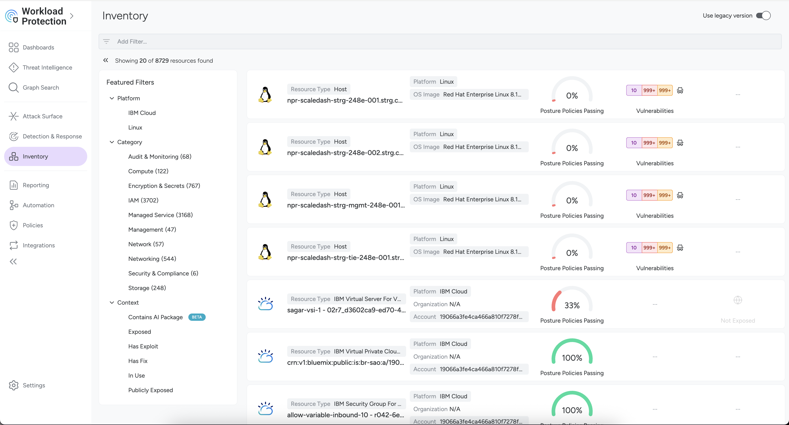
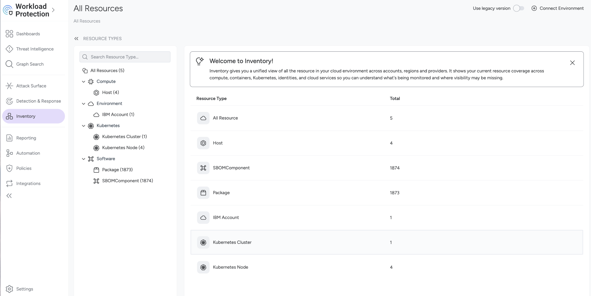
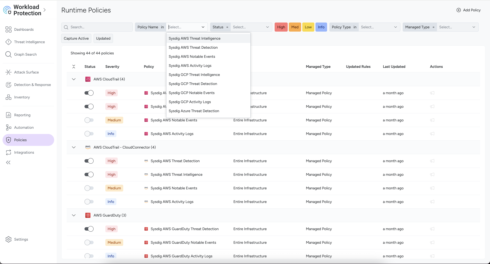
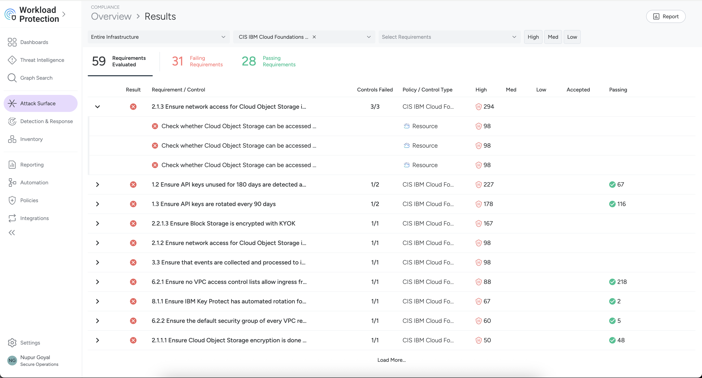

---

copyright:
  years: 2026
lastupdated: "2026-09-07"

keywords:

subcollection: storage-scale-da

---

{:shortdesc: .shortdesc}
{:codeblock: .codeblock}
{:screen: .screen}
{:external: target="_blank" .external}
{:pre: .pre}
{:tip: .tip}
{:note: .note}
{:important: .important}
{:table: .aria-labeledby="caption"}

# IBM Cloud Security and Compliance Center Workload Protection
{: #scc-overview}

IBM Cloud® Security and Compliance Center Workload Protection (SCCWP) helps you accelerate your hybrid cloud adoption by addressing security and regulatory compliance. Easily identify vulnerabilities, validate compliance and permissions, block runtime threats and respond to incidents faster across any platform: Cloud or on-prem, hosts, or VMs and containers or OpenShift/Kubernetes. A cloud-native application protection platform (CNAPP) powered by runtime insights.

Workload protection is an IBM service, placed under the Observability and Compliance section. Through the IBM Storage Scale, automation creates the workload protection instances. SCC Workload Protection is an agentless and does not need anything to be installed. When Cloud Security Posture Management (CSPM) is enabled, then the posture management helps you to populate the data.

In IBM Cloud, IBM Cloud® Security and Compliance Center Workload Protection automates compliance checks for IBM Cloud Framework for Financial Services, Digital Operational Resilience Act (DORA), CIS IBM Cloud Foundations Benchmark, PCI, and many other industry related or best practices standards. With a detailed inventory of your IBM Cloud resources and prioritization based on full context it facilitates the resolution and management of collected violations.
For more information, see [About IBM Cloud Security Posture Management (CSPM)](/docs/workload-protection?topic=workload-protection-about).

Workload protection is supported majorly in these 3 pillars:
1. Posture management
2. Vulnerability management
3. Threat detection and response

* **Posture Management:**

Provides a unified and centralized platform to manage the security and compliance of applications, workloads, and infrastructure that run on IBM Cloud. In other clouds, and on-prem, covering managed services, hosts. Cloud Security Posture Management (CSPM) helps you to identify misconfigurations and validate compliance across IBM Cloud. This also offers an inventory to all your Cloud assets (compute resources, managed services, identities, entitlements, hosts, virtual machines, and clusters), whether they are in the Cloud or on-premises.

* **Vulnerability management**

Scanning for vulnerabilities on OS packages and third-party libraries such as Java, Python, Golang, Javascript, or Ruby. This offers a vulnerability management overview dashboard, advanced and customizable reporting, alerting of new vulnerabilities or unscanned images and routing to ticketing systems. Advanced policies to customize vulnerability criteria and blocking per environment or any scope.

* **Threat detection and response**

In addition to rules, behavioral analysis allows detection of common threats and malware such as crypto mining activities and workload profiling to automatically define expected behavior that can extend detection capabilities. Advanced remediation, allowing to automatically run corrective actions including killing processes, killing or pausing containers, and so on.

## SCC Workload Protection on IBM Storage Scale cluster
{: #scc-scale-cluster}

The following new variables are introduced for SCC Workload Protection:

* `sccwp_enable`: To create the SCC Workload Protection, set the value to "true". By default, this value is set as true. If you set the value as "false" the SCC Workload Protection will not be created.

* `sccwp_service_plan`: This is used to enable the service plan for SCC Workload Protection. Valid values are free-trial and graduated-tier only.

* `cspm_enabled`: The default value for `cspm_enabled` is set to "true". It is recommended to keep this setting enabled.

The default value for `cspm_enabled` is set to "true". It is recommended to keep this setting enabled, as it ensures that the App Config Aggregator is properly configured along with the IAM trusted profile policy. This setup is necessary to retrieve comprehensive account data and display it on the dashboard. If `cspm_enabled` is set to "false", no data is visible on the dashboard.
{: note}

* `app_config_plan`: Specify the IBM service pricing plan for the application. Allowed values are 'basic', 'standard', 'enterprise'.

## Accessing the SCC Workload Protection
{: #accessing-scc}

When you access the UI for the service, all the above-mentioned pillars are covered (Threat/Vulnerabilities/Compliance).

1. Go to the {{site.data.keyword.cloud_notm}} console, in the **Navigation Menu**, click **Security** > **Compliance**.

    In the **Search** field, type the name and you find the SCC Workload Protection instance. To view the dashboard, click **Open dashboard**.

    {: caption="Security and Compliance Workload protection dashboard" caption-side="bottom"}

2. Once the CSPM is enabled, all the data from the back-end will be pushed to the dashboard as shown below:

    {: caption="SCC Compliance" caption-side="bottom"}

3. When the `cspm_enabled` is enabled, the **Configuration aggregator** records the data from all the resources across regions in your account. The configuration aggregator is enabled by default from the automation. You can also choose the specific plan under `app_config_plan` as shown below:

    {: caption="SCC Application configuration" caption-side="bottom"}

4. To view the connected agents, click **Agents** in the top-right corner. Select a host and navigate to **Vulnerability Findings** to review the detailed findings and the recommended remediation actions available in the dashboard.

    {: caption="SCC Sysdig Agents" caption-side="bottom"}
    
    {: caption="SCC Vulnerability Findings - 1" caption-side="bottom"}
    
    {: caption="SCC Vulnerability Findings - 2" caption-side="bottom"}
    

5. Inventory is agentless, which is provided by IBM cloud. For example, in the account we have 1000 resources, you can add the filters and validate all the resources of the inventory i.e, Security groups/Instances/FIP and so on. When a certain security group does not have the rules set, then all of them can be monitored here.

    * Enable the **Use legacy version** toggle option at top right to view the legacy inventory version. 

    {: caption="SCC Inventory - Legacy" caption-side="bottom"}

    * Disable the **Use legacy version** toggle option at top right to view the latest inventory version.

    {: caption="SCC Inventory - New" caption-side="bottom"}

    Users can just toggle the **Use legacy version** option to view older version or newer version of the dashboard.
    {: note}
    

6. Under **Policies**, you can go ahead and configure the policies. Based on Linux or RHEL platform, certain policies can be set. These are set of rules, based on which you can configure the policy.

    {: caption="SCC runtime policies" caption-side="bottom"}

7. On **Attack Surface**, you can run the scans and this shows the severity of the issues and that could be helped to be scanned. You can filter based on high, medium, and low. For more information, see [Scanning Guidelines](https://docs.sysdig.com/en/sysdig-secure/scanning-usecases/){: external}.

    {: caption="Dashboard view for SCCWP" caption-side="bottom"}

If the IAM permissions for the SCC Workload Protection are not enabled right, then the error occurs stating:
`Error: [ERROR] Error getting trusted profile policy: You are not allowed to retrieve the requested policy`.
{: note}

So, below are the required permissions for SCC Workload Protection are:

| Service | Resources | Platform roles | Service roles |
| ------- | --------- | ---- | ---- |
| App configuration | All | Administrator | Manager |
| All Identity and Access enabled services | All | Administrator | Manager |
| Security and Compliance Center Workload Protection | All | Administrator | -- |
{: caption="SCC permissions" caption-side="bottom"}

## Unified agent integration logic
{: #unified-agent-integration-logic}

The cluster deploys a single, unified Sysdig agent to support both monitoring and security, automatically tailoring its configuration based on the specified deployment variables.

### Dual integration (metrics and security)
{: #dual-integration}

If both `observability_monitoring_enable = true` and `enable_sccwp = true`, the cluster integrates with both monitoring and SCCWP instances. A single agent is installed on the host and connects to both {{site.data.keyword.cloud_notm}} services simultaneously. It routes performance metrics to the monitoring instance while streaming security and compliance data to the Workload Protection instance.

### Standalone operation
{: #standalone-operation}

If any one of these variable (`observability_monitoring_enable` and `enable_sccwp`) is enabled, the agent is still deployed, but it is configured to communicate solely with the active service.

### Workload Protection
{: #workload-protection-details}

When SCCWP is enabled, the Sysdig secure engine provides continuous posture management, vulnerability assessment, and runtime protection. In this setup, the `host_scanner: enabled: true` configuration is applied, allowing the agent to monitor deep OS system calls, identify real-time threats, and scan installed host packages for known CVEs.
